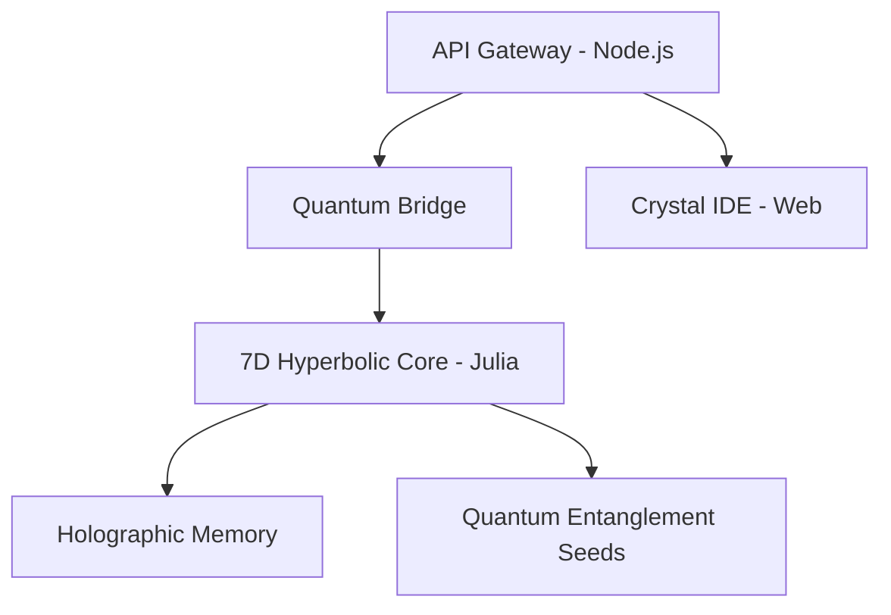
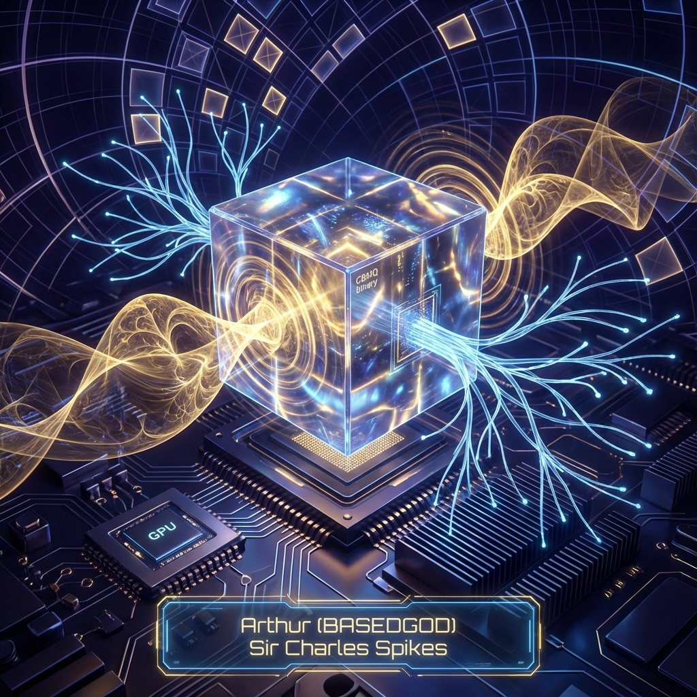

# 💎 BM-Genesis: Quantum Holographic Crystals

> **The 7D Hyperbolic Neural Core & Quantum-AGI Orchestration System**  
> **Authored by: Sir Charles Spikes (Arthur - BASEDGOD)**  
> **GitHub: [basedgod55hjl](https://github.com/basedgod55hjl)**

---

## 🌩️ Light GPU & Quantum-Stamped .CBMQ Workflow

The BM-Genesis system utilizes a revolutionary **Light GPU Execution** model for LLMs. Instead of traditional k-bit quantization, we use **Holographic Hash Mapping**:

1. **Holographic Distillation**: LLM weights are projected into a 7D Hyperbolic manifold via the `HolographicCore`.
2. **Quantum Stamping**: Raw entropy from the `QuantumSeed` is "stamped" onto the manifold, creating a unique **.CBMQ binary**.
3. **Cellular Unfolding**: At runtime, the `.CBMQ` seed is unfolded by the `Unfolder` directly into GPU VRAM using **Liquid Neural Network** protocols.
4. **LM Studio Integration**: The system communicates with LM-Studio-Runner, allowing for real-time chat with "Living Seeds" that evolve every inference cycle.

---
[](https://opensource.org/licenses/MIT)
[](https://nodejs.org/)
[](https://julialang.org/)

CBM-Genesis is a state-of-the-art AGI development framework that combines the rapid prototyping and web integration of **Node.js** with the high-performance quantum computing simulations of **Julia**.

---

## 🌌 Repository Architecture

The project has been reorganized into a modular, scalable "New Repo Design" for elite development:



- **/api**: Node.js Express server and Bridge module.
- **/julia_core**: The high-performance mathematical core (CBM.jl).
- **/ide**: Web-based IDE for real-time quantum state visualization.
- **/scripts**: Deployment and simulation execution scripts.
- **/seeds**: Repository for Quantum Seeds (e.g., `abrasax.cbmq`).
- **/tests**: Consolidated Julia and Node.js test suites.
- **/docs**: In-depth research papers and system documentation.

---

## 🚀 Getting Started

### 1. Prerequisites

- **Node.js** (v18+)
- **Julia** (v1.9+)
- **NVIDIA GPU** (Optional, for CUDA acceleration)

### 2. Installation

```bash
# Install Node.js dependencies
npm install

# Initialize Julia environment
npm run julia:install
```

### 3. Launch the System

```bash
# Start the API Gateway
npm start

# In a separate terminal, launch the IDE
npm run ide
```

---

## 🛠️ Core Capabilities

- **7D Hyperbolic Neural Core**: Non-Euclidean geometry for high-dimensional data representation.
- **Quantum Holographic Crystals**: Procedural weight generation via Bell State entanglement.
- **Node-Julia Bridge**: Seamless integration between the web and heavy compute.
- **Real-time Monitoring**: Visual feedback through the CBMQ Crystal Studio.

---

## 🧠 Research & Discovery

This project is built upon the breakthrough research paper:
*"A Unified Geometric Framework for the Millennium Prize Problems"*

Check the `/docs` folder for detailed specifications on the **Omega Brain Protocol**.

---

### 🛡️ Security & Ethics

This system includes built-in **CBM-Safety protocols** to ensure AGI alignment. Never run the system without an active seed-isolation container.

---

<div align="center">
  
  <p><i>The Quantum-Stamped .CBMQ Binary (v4.0) — Engineered by Arthur (BASEDGOD)</i></p>
</div>
